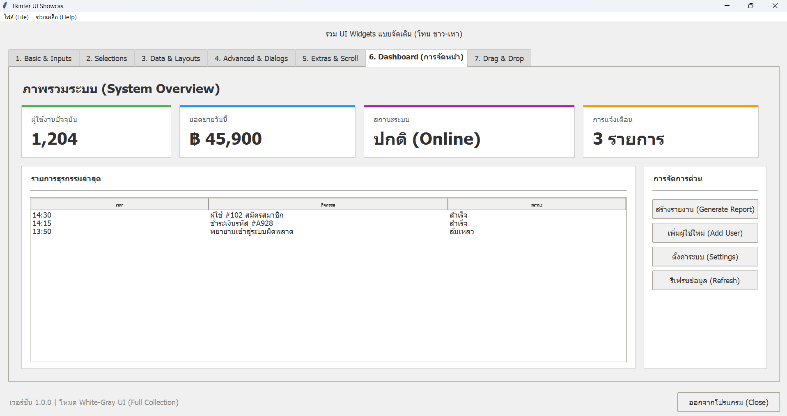
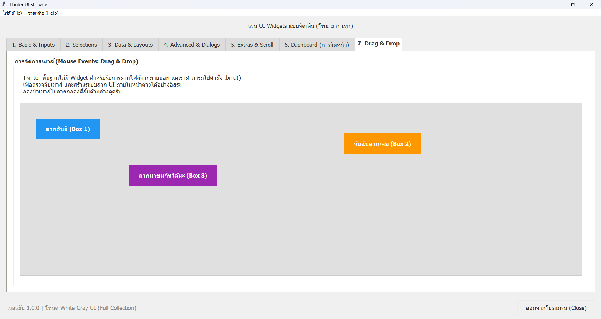
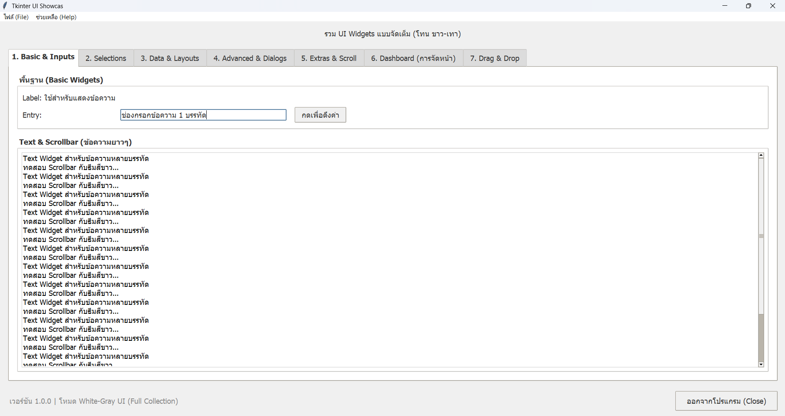
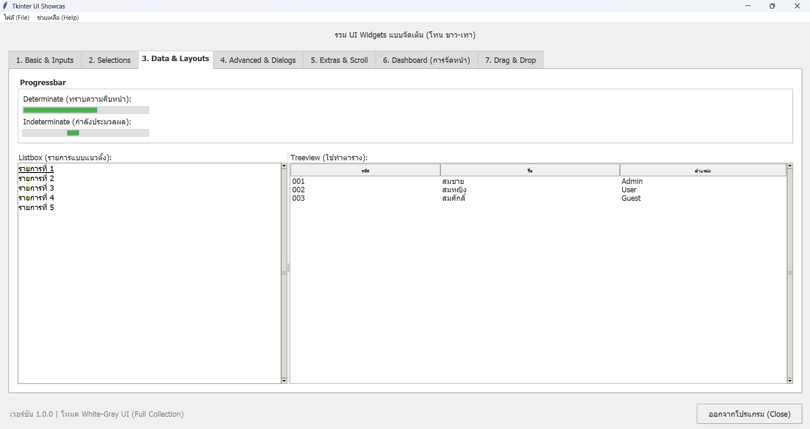
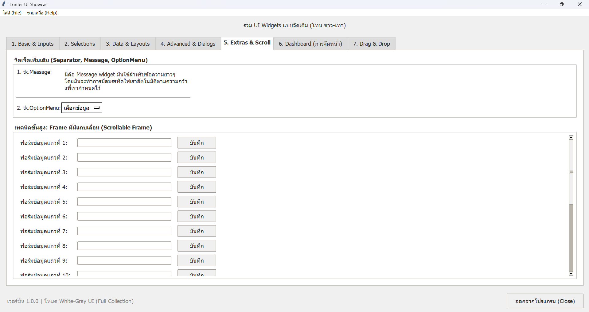
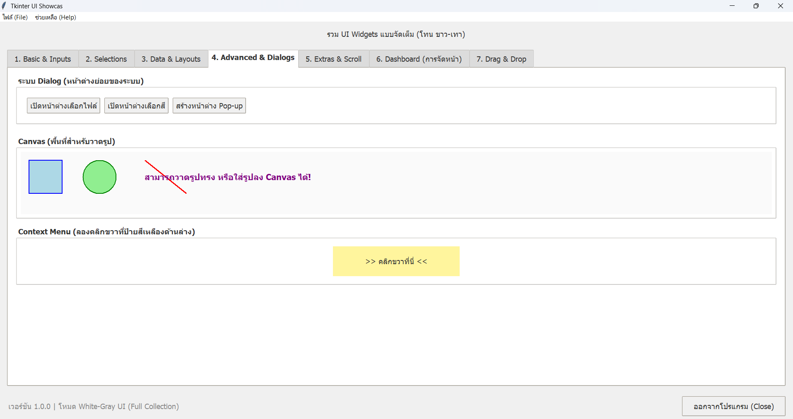

# Tkinter UI Showcase (White-Gray Theme)

## Overview
แอปพลิเคชันตัวอย่าง (Boilerplate/Showcase) สำหรับการพัฒนา GUI ด้วยภาษา Python โดยใช้ไลบรารีมาตรฐาน `tkinter` และ `tkinter.ttk` แอปพลิเคชันนี้ถูกออกแบบมาเพื่อแสดงผลวิดเจ็ต (Widgets) และเทคนิคการจัดเลย์เอาต์ (Layout Management) แบบครบถ้วน ตั้งแต่ระดับพื้นฐานไปจนถึงระดับสูง

นอกจากนี้ โปรเจกต์ยังมีการแก้ไขปัญหาทางเทคนิคของ Tkinter บนระบบปฏิบัติการ Windows เช่น การเปิดใช้งาน High DPI Awareness เพื่อป้องกันปัญหา UI เบลอเมื่อสเกลหน้าจอมากกว่า 100% และการตั้งค่าฟอนต์มาตรฐานเป็น Tahoma เพื่อความสมดุลระหว่างภาษาไทยและภาษาอังกฤษ

## Key Features
* **High DPI Awareness:** เรียกใช้ Windows API (`ctypes.windll.shcore.SetProcessDpiAwareness`) เพื่อเรนเดอร์ UI แบบเวกเตอร์ แก้ปัญหาภาพแตก
* **Custom Theming:** ใช้ `ttk.Style` ร่วมกับธีม `clam` เพื่อปรับแต่งสีพื้นหลัง สีขอบ ลบเส้นประ (Focus Ring) ออกจากแท็บ และใช้พารามิเตอร์ `expand` เพื่อยกดับแท็บที่ถูกเลือกให้เด่นชัดขึ้น
* **Maximized Window:** ใช้คำสั่ง `root.state('zoomed')` เพื่อขยายโปรแกรมให้เต็มหน้าต่างโดยยังคงแถบ Taskbar และ Title bar ไว้ตามมาตรฐานแอปพลิเคชัน Windows
* **Mouse Event Handling:** สาธิตการสร้างระบบ Internal Drag & Drop ด้วยการผูกเหตุการณ์ `<ButtonPress-1>` และ `<B1-Motion>`
* **Comprehensive Widget Examples:** แบ่งหมวดหมู่การสาธิตออกเป็น 7 แท็บ ได้แก่:
    1.  **Basic & Inputs:** `Label`, `Entry`, `Button`, `Text` พร้อม `Scrollbar`
    2.  **Selections:** `Combobox`, `Checkbutton`, `Radiobutton`, `Spinbox`, `Scale`
    3.  **Data & Layouts:** `Progressbar`, `PanedWindow`, `Listbox`, `Treeview`
    4.  **Advanced & Dialogs:** `filedialog`, `colorchooser`, `Toplevel` (Pop-up), `Canvas`, Context Menu (คลิกขวา)
    5.  **Extras & Scroll:** การสร้าง Scrollable Frame ด้วยเทคนิคการนำ `Frame` บรรจุลงใน `Canvas`
    6.  **Dashboard Layout:** ตัวอย่างการประยุกต์ใช้ `Frame` สร้างการ์ดแสดงผลสถิติ (KPI Cards) และตารางข้อมูลแบบ Modern UI
    7.  **Drag & Drop:** ระบบการจับลากและวาง UI ภายในหน้าต่างโปรแกรม (Internal Drag and Drop)

## Screenshots
*(คำแนะนำ: นำไฟล์รูปภาพจากการแคปหน้าจอโปรแกรมไปใส่ในโฟลเดอร์ `assets/` ตามชื่อที่กำหนดไว้)*

### 1. Dashboard View (หน้าต่างรวมสถิติ)


### 2. Drag & Drop (ระบบลากและวาง)


### 3. Basic Inputs & Data Grids (หน้าต่างรับค่าและตารางข้อมูล)



### 4. Scrollable Frame & Dialogs (หน้าต่างแบบเลื่อนได้และหน้าต่างย่อย)



## Repository Structure
โครงสร้างไฟล์และไดเรกทอรีของโปรเจกต์:

```text
tkinter-ui-showcase/
│
├── assets/                 # ไดเรกทอรีสำหรับเก็บไฟล์รูปภาพประกอบ README
│   ├── tab1_and_3.png      
│   ├── tab4_and_5.png      
│   ├── tab6_dashboard.png  
│   └── tab7_drag_drop.png  # [เพิ่มใหม่] รูปภาพสำหรับแท็บ 7
│
├── showcase.py             # Source Code หลักของแอปพลิเคชัน
└── README.md               # เอกสารอธิบายรายละเอียดของโปรเจกต์
```

## Prerequisites
* Python 3.x (ทดสอบและแนะนำให้ใช้ Python 3.8 ขึ้นไป)
* ระบบปฏิบัติการ Windows (เนื่องจากมีการเรียกใช้ `ctypes.windll` สำหรับจัดการ DPI หากรันบน macOS หรือ Linux ฟังก์ชันนี้จะถูกข้ามไปโดยอัตโนมัติ)
* ไม่จำเป็นต้องติดตั้งแพ็กเกจภายนอก (Third-party packages) เพิ่มเติม เนื่องจากใช้ไลบรารีมาตรฐานของ Python ทั้งหมด

## Installation & Usage

1. **Clone the repository:**
   ดาวน์โหลดโปรเจกต์ลงในเครื่อง Local ของคุณ
   ```bash
   git clone [https://github.com/USERNAME/tkinter-ui-showcase.git](https://github.com/USERNAME/tkinter-ui-showcase.git)
   cd tkinter-ui-showcase
   ```

2. **Run the application:**
   ใช้คำสั่ง Python รันสคริปต์หลัก
   ```bash
   python showcase.py
   ```